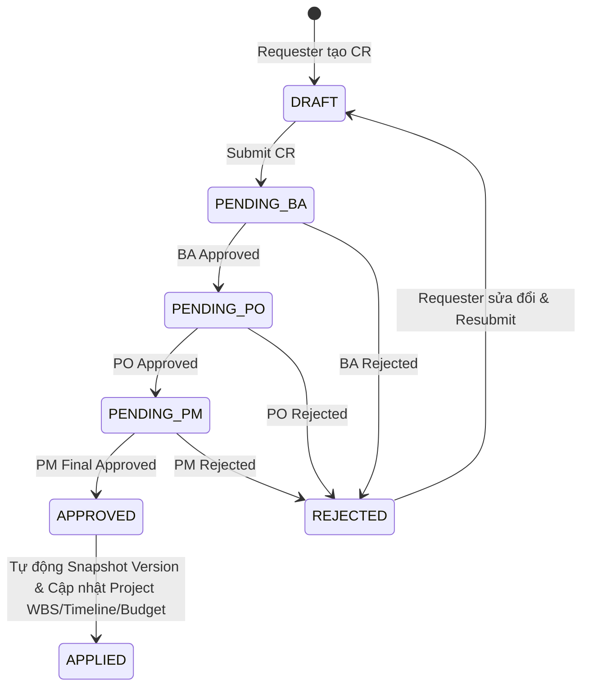

# Roadmap: Workflow & Reporting Module (Phase 4)

> **Phiên bản:** 1.0 | **Cập nhật:** 2026-08-16  
> **Trạng thái:** ⏳ Chưa bắt đầu (0%) | **Ngày hoàn thành:** --  
> **Mức độ ưu tiên:** Critical – Quy trình kiểm soát thay đổi, truy vết lịch sử & báo cáo chuyên sâu  
> **Điều kiện tiên quyết:** [x] Phase 1 (Auth & RBAC), Phase 2 (Project Core & CPM), Phase 3 (AI Features) đã hoàn thành

---

## Tổng quan Module

Module **Workflow & Reporting (Phase 4)** thiết lập cơ chế kiểm soát chất lượng dự án toàn diện, tự động hóa quy trình phê duyệt thay đổi (Change Request), lưu trữ các mốc phiên bản dự án (Versioning & Rollback), cung cấp biểu đồ điều hành nâng cao (Gantt, Agile, EVA) và xuất báo cáo tài liệu chuyên nghiệp (DOCX & XLSX).

### 5 Trụ cột chính:
1. **Change Request & Multi-Level Approval Workflow (SOP-CR):** Quy trình phê duyệt thay đổi đa cấp theo trình tự `BA -> PO -> PM`, hỗ trợ từ chối/yêu cầu sửa đổi và tự động áp dụng cập nhật vào dự án khi được duyệt hoàn tất.
2. **Project Versioning & Rollback (SOP-PM-004):** Tự động tạo snapshot JSONB của dự án trước mỗi thay đổi lớn, cho phép so sánh diff trực quan giữa 2 phiên bản và rollback an toàn mà không làm mất lịch sử audit.
3. **Advanced Dashboard & Real-Time Analytics:** Biểu đồ Gantt tương tác cao với đường găng Critical Path, biểu đồ Agile (Burndown, Burnup, Velocity), phân tích giá trị thu được Earned Value Analysis (EVA, CPI, SPI) và WebSocket cập nhật thời gian thực.
4. **Report Export Engine (SOP-RPT-001):** Sinh báo cáo chuyên nghiệp định dạng **DOCX** (python-docx) và **XLSX** (openpyxl) qua Celery worker, lưu trữ trên MinIO và tải về an toàn.
5. **Audit Timeline & Activity Stream:** Truy vết mọi biến động trong hệ thống với bộ lọc đa tiêu chí và phân trang hiệu năng cao (cursor-based pagination).

---

## Hiện trạng & Hạ tầng sẵn có

| Thành phần | Trạng thái | Ghi chú |
|---|---|---|
| Database Schema: `change_requests`, `approvals`, `project_versions`, `audit_logs` | Đã migrate | Sẵn sàng cho workflow & versioning |
| RBAC Roles: `PM`, `BA`, `PO`, `Member`, `Customer`, `Admin` | Đã có sẵn | Đã phân quyền chi tiết |
| Celery + Redis Task Queue | Đã có sẵn | Dành cho async report generation |
| MinIO Storage Service | Đã có sẵn | Bucket `ai-project-files` lưu trữ report docs |
| WebSocket Infra | Sẵn sàng | FastAPI WebSocket endpoint + Redis pub/sub |

---

## Danh mục tính năng cần triển khai

| Tính năng | Mã SOP | Độ ưu tiên | Trạng thái | Backend Task | Frontend Component |
|---|---|---|---|---|---|
| Change Request Workflow Engine | SOP-CR | Critical | ⏳ Chưa bắt đầu | `WorkflowService` + Approvals API | `ChangeRequestDrawer`, `ApprovalTimeline` |
| Project Versioning & Diff/Rollback | SOP-PM-004 | High | ⏳ Chưa bắt đầu | `VersioningService` + Snapshots | `VersionHistoryModal`, `VersionDiffView` |
| Interactive Gantt Chart + CPM | SOP-PM-003 | Critical | ⏳ Chưa bắt đầu | `DashboardService.get_gantt_data` | `GanttChart`, `DependencyLinks` |
| Agile Charts (Burndown, Burnup, Velocity) | Reporting | High | ⏳ Chưa bắt đầu | `DashboardService.get_agile_metrics` | `BurndownChart`, `VelocityChart` |
| EVA Metrics Engine (CPI, SPI, EAC) | Reporting | High | ⏳ Chưa bắt đầu | `DashboardService.calculate_eva` | `EVACard`, `FinancialHealthWidget` |
| DOCX/XLSX Export via Celery | SOP-RPT-001 | High | ⏳ Chưa bắt đầu | `ReportService` + `ai_tasks.py` | `ReportExportModal`, `DownloadCenter` |
| Audit Timeline Feed | Security | Medium | ⏳ Chưa bắt đầu | `AuditLogService` (Cursor pagination) | `AuditTimeline`, `ActivityFeed` |

---

## Chi tiết kế hoạch triển khai theo Phase

---

## GIAI ĐOẠN 4.1 – Change Request & Multi-Level Approval Workflow (SOP-CR)

> **Trạng thái:** ⏳ Chưa bắt đầu | **Ngày hoàn thành:** --  
> **Mục tiêu:** Xây dựng quy trình xử lý yêu cầu thay đổi (CR) chuẩn mực. Khách hàng/Member tạo CR -> Hệ thống route tuần tự qua BA (Business Review) -> PO (Product Impact) -> PM (Final Approval). Khi PM duyệt -> Tự động snapshot version, update WBS/Budget/Timeline dự án và chạy lại CPM.

### 1. Luồng xử lý (Workflow)


### 2. Backend Implementation

**[NEW] `backend/app/services/workflow_service.py`**
```python
class WorkflowService:
    async def initiate_change_request_workflow(self, cr_id: UUID, db: AsyncSession) -> None:
        """Tạo chuỗi approvals tuần tự (sequence_order: 1-BA, 2-PO, 3-PM)."""
        pass
    
    async def process_approval_decision(self, approval_id: UUID, approver: User, decision: str, comments: str, db: AsyncSession) -> None:
        """Xác thực quyền, kiểm tra thứ tự sequence và áp dụng thay đổi khi PM duyệt xong."""
        pass
```

**[MODIFY] `backend/app/api/v1/endpoints/change_requests.py`**
- `POST /api/v1/change-requests` — Tạo mới Change Request.
- `GET /api/v1/change-requests` — Danh sách CR (lọc theo project, status, role).
- `GET /api/v1/change-requests/{cr_id}` — Chi tiết CR kèm chuỗi approvals và AI Impact Report.
- `PUT /api/v1/change-requests/{cr_id}` — Cập nhật CR khi bị từ chối và resubmit.
- `POST /api/v1/approvals/{approval_id}/decision` — Gửi quyết định duyệt (APPROVE / REJECT) kèm nhận xét.

### 3. Frontend Implementation

**[NEW] `frontend/src/features/change-requests/components/ChangeRequestList.tsx`**
- Bảng danh sách CR: Mã CR, Tiêu đề, Loại thay đổi (Scope, Timeline, Budget), Trạng thái, Bước phê duyệt hiện tại, Người tạo.

**[NEW] `frontend/src/features/change-requests/components/ApprovalTimeline.tsx`**
- Stepper trực quan hiển thị tiến trình: `1. BA Review` -> `2. PO Review` -> `3. PM Approval` kèm thời gian và nhận xét.

**[NEW] `frontend/src/features/change-requests/components/ApprovalActionDialog.tsx`**
- Dialog dành cho approver: Xem tóm tắt tác động AI -> Chọn Approve/Reject -> Nhập ghi chú bắt buộc khi Reject.

---

## GIAI ĐOẠN 4.2 – Project Versioning & Rollback System (SOP-PM-004)

> **Trạng thái:** ⏳ Chưa bắt đầu | **Ngày hoàn thành:** --  
> **Mục tiêu:** Lưu trữ snapshot toàn bộ trạng thái dữ liệu dự án (WBS, Tasks, Dependencies, Assignments, Milestones, Budget) dạng JSONB vào bảng `project_versions`. Cho phép PM so sánh diff giữa 2 version và rollback an toàn khi cần thiết.

### 1. Luồng xử lý (Workflow)
```
Trigger (Auto trước khi Apply CR / Apply AI Optimization hoặc PM tạo Manual Checkpoint)
  -> VersioningService serialize toàn bộ entity dự án thành JSONB Snapshot
  -> Lưu vào bảng project_versions
  -> Khi cần Rollback: PM chọn version -> Tự động backup "Pre-rollback Snapshot"
  -> Phục hồi dữ liệu -> Chạy lại CPM Engine -> Ghi Audit Log -> Bắn thông báo toàn team
```

### 2. Backend Implementation

**[NEW] `backend/app/services/versioning_service.py`**
```python
class VersioningService:
    async def create_snapshot(self, project_id: UUID, version_name: str, change_reason: str, user: User, db: AsyncSession) -> ProjectVersion:
        """Serialize toàn bộ cấu trúc dự án và lưu vào project_versions."""
        pass
    
    async def restore_version(self, project_id: UUID, version_id: UUID, actor: User, db: AsyncSession) -> None:
        """Phục hồi dữ liệu từ snapshot và chạy lại CPM engine."""
        pass
    
    async def compare_versions(self, version_a_id: UUID, version_b_id: UUID, db: AsyncSession) -> VersionDiffResponse:
        """So sánh diff chi tiết: Tasks thêm/xóa/sửa, biến động ngày và ngân sách."""
        pass
```

**[NEW] `backend/app/api/v1/endpoints/project_versions.py`**
- `GET /api/v1/projects/{project_id}/versions` — Danh sách các snapshot version.
- `POST /api/v1/projects/{project_id}/versions` — Tạo checkpoint thủ công.
- `GET /api/v1/projects/{project_id}/versions/{version_id}` — Chi tiết dữ liệu snapshot.
- `POST /api/v1/projects/{project_id}/rollback` — Thực hiện rollback về version chỉ định.
- `GET /api/v1/projects/versions/compare?v1={id}&v2={id}` — Trả về diff giữa 2 versions.

### 3. Frontend Implementation

**[NEW] `frontend/src/features/versioning/components/VersionHistoryDrawer.tsx`**
- Danh sách timeline các version: Tên version, Người tạo, Lý do tạo, Ngày giờ.

**[NEW] `frontend/src/features/versioning/components/VersionDiffModal.tsx`**
- Giao diện đối soát 2 cột (Side-by-side Diff): Xanh lá (Thêm mới), Đỏ (Bị xóa), Vàng (Chỉnh sửa).

**[NEW] `frontend/src/features/versioning/components/RollbackConfirmDialog.tsx`**
- Modal cảnh báo rủi ro, yêu cầu gõ "ROLLBACK" xác nhận trước khi thực hiện.

---

## GIAI ĐOẠN 4.3 – Advanced Dashboard & Real-Time Analytics

> **Trạng thái:** ⏳ Chưa bắt đầu | **Ngày hoàn thành:** --  
> **Mục tiêu:** Xây dựng Dashboard điều hành chuyên nghiệp với biểu đồ tương tác Gantt Chart, biểu đồ tiến độ Agile và chỉ số tài chính EVA (Earned Value Analysis). Cập nhật dữ liệu real-time qua WebSocket.

### 1. Quy cách biểu đồ & Chỉ số EVA
- **Gantt Chart:** Thể hiện phân rã Phase/Task, liên kết Dependency (FS/SS/FF/SF), làm nổi bật đường găng **Critical Path** (màu đỏ cam) và hỗ trợ zoom Days/Weeks/Months.
- **Agile Charts:**
  - **Burndown Chart:** Đường lý tưởng vs Thực tế còn lại theo từng Sprint từ `worklogs`.
  - **Burnup Chart:** Tổng Story Points vs Số lượng đã hoàn thành.
  - **Velocity Chart:** Tốc độ hoàn thành của team qua các sprint.
- **Earned Value Analysis (EVA):**
  - $PV$ (Planned Value), $EV$ (Earned Value), $AC$ (Actual Cost).
  - $CPI = \frac{EV}{AC}$ (Chỉ số hiệu quả chi phí), $SPI = \frac{EV}{PV}$ (Chỉ số hiệu quả tiến độ).
  - $EAC = \frac{BAC}{CPI}$ (Dự báo tổng chi phí hoàn thành).

### 2. Backend Implementation

**[NEW] `backend/app/services/dashboard_service.py`**
```python
class DashboardService:
    async def get_gantt_chart_data(self, project_id: UUID, db: AsyncSession) -> GanttDataResponse:
        pass
    
    async def calculate_eva_metrics(self, project_id: UUID, db: AsyncSession) -> EVAMetricsResponse:
        pass
```

**[NEW] `backend/app/api/v1/endpoints/dashboard.py` & `websocket.py`**
- `GET /api/v1/dashboard/gantt/{project_id}`
- `GET /api/v1/dashboard/burndown/{project_id}?sprint_id={id}`
- `GET /api/v1/dashboard/eva/{project_id}`
- `WebSocket /ws/dashboard/{project_id}` — Kênh real-time phát sự kiện cập nhật tiến độ.

### 3. Frontend Implementation

**[NEW] `frontend/src/features/dashboard/components/GanttChart/`**
- `GanttTimeline.tsx`, `GanttTaskBar.tsx`, `GanttDependencyLinks.tsx`, `GanttToolbar.tsx`.

**[NEW] `frontend/src/features/dashboard/components/AgileCharts/`**
- `BurndownChart.tsx`, `BurnupChart.tsx`, `VelocityChart.tsx` (Recharts).

**[NEW] `frontend/src/features/dashboard/components/EVAMetricsCard.tsx`**
- Hiển thị chỉ số CPI, SPI, EAC kèm cảnh báo sức khỏe tài chính.

---

## GIAI ĐOẠN 4.4 – Report Generation & Export (DOCX & XLSX) (SOP-RPT-001)

> **Trạng thái:** ⏳ Chưa bắt đầu | **Ngày hoàn thành:** --  
> **Mục tiêu:** Cho phép xuất báo cáo tình trạng dự án định kỳ (Weekly/Monthly Status Report, Financial Breakdown) ra định dạng Word (DOCX) và Excel (XLSX) theo mẫu chuẩn chuyên nghiệp.

### 1. Luồng xử lý (Workflow)
```
User chọn Template & Format (DOCX/XLSX) -> POST /api/v1/reports/generate -> Trả về task_id (HTTP 202)
  -> Celery Worker thu thập dữ liệu dự án -> Gọi ReportService sinh file
  -> Upload file lên MinIO bucket `ai-project-files/reports/`
  -> Sinh Pre-signed URL (hạn 24h) và lưu vào bảng generated_reports
  -> Client nhận thông báo và tải file về an toàn
```

### 2. Backend Implementation

**[NEW] `backend/app/services/report_service.py`**
```python
class ReportService:
    async def generate_docx_report(self, project_id: UUID, template_type: str, db: AsyncSession) -> bytes:
        """Sử dụng python-docx tạo tài liệu Word đầy đủ cấu trúc."""
        pass
    
    async def generate_xlsx_report(self, project_id: UUID, db: AsyncSession) -> bytes:
        """Sử dụng openpyxl tạo sổ tính Excel nhiều sheet chi tiết."""
        pass
```

**[MODIFY] `backend/app/tasks/ai_tasks.py`**
- Thêm `generate_report_task(project_id: str, format: str, template_type: str, user_id: str)`.

**[NEW] `backend/app/api/v1/endpoints/reports.py`**
- `POST /api/v1/reports/generate` — Tiếp nhận yêu cầu xuất báo cáo.
- `GET /api/v1/reports/status/{task_id}` — Lấy link tải về khi Celery hoàn tất.
- `GET /api/v1/reports/history/{project_id}` — Lịch sử các báo cáo đã xuất.

### 3. Frontend Implementation

**[NEW] `frontend/src/features/reports/components/ReportExportModal.tsx`**
- Modal chọn định dạng xuất, chọn Template và chọn khoảng thời gian.
- Hiển thị nút "Download Report" ngay khi file sẵn sàng.

---

## GIAI ĐOẠN 4.5 – Audit Timeline & Activity Stream

> **Trạng thái:** ⏳ Chưa bắt đầu | **Ngày hoàn thành:** --  
> **Mục tiêu:** Cung cấp nhật ký kiểm toán (Audit Trail) minh bạch cho Admin và PM để theo dõi lịch sử chỉnh sửa trên mọi đối tượng trong dự án.

### 1. Luồng xử lý (Workflow)
```
Mọi thao tác thay đổi dữ liệu (CREATE, UPDATE, DELETE, ROLLBACK, APPROVE)
  -> Tự động ghi vào bảng audit_logs qua Middleware/Service hooks
  -> GET /api/v1/projects/{project_id}/audit-logs trả về dữ liệu phân trang Cursor
  -> Frontend render dòng thời gian Activity Stream trực quan
```

### 2. Backend Implementation

**[NEW] `backend/app/services/audit_service.py`**
- Class `AuditLogService`: Quản lý truy vấn và lọc dữ liệu nhật ký kiểm toán theo `entity_type`, `action`, `user_id`, `date_range`.

**[MODIFY] `backend/app/api/v1/endpoints/audit_logs.py`**
- `GET /api/v1/projects/{project_id}/audit-logs` — Lấy danh sách audit log theo cursor pagination.

### 3. Frontend Implementation

**[NEW] `frontend/src/features/audit/components/AuditTimeline.tsx`**
- Timeline trực quan hiển thị người thực hiện, hành động, đối tượng bị ảnh hưởng và diff thay đổi (old value vs new value).

---

## Kế hoạch kiểm thử (Testing Strategy)

> **Trạng thái kiểm thử:** ⏳ Chưa thực hiện

1. **Unit Tests (`tests/unit/services/`):**
   - Test chuỗi phê duyệt tuần tự BA -> PO -> PM và ngăn chặn duyệt vượt cấp.
   - Test hàm tính toán chỉ số EVA: $CPI = EV / AC$, $SPI = EV / PV$, $EAC = BAC / CPI$ và xử lý các ca biên ($AC = 0$, $PV = 0$).
   - Test sinh file DOCX và XLSX hợp lệ theo cấu trúc template.
2. **Integration Tests (`tests/integration/test_workflow_versioning.py`):**
   - Test quy trình phê duyệt CR -> Tự động snapshot -> Cập nhật WBS -> Chạy lại CPM.
   - Test quy trình Rollback phiên bản và khôi phục trạng thái toàn vẹn của Task & Dependencies.
   - Test WebSocket broadcast khi có sự kiện thay đổi tiến độ dự án.
3. **Correctness & Invariant Tests:**
   - Đảm bảo snapshot JSONB lưu trữ đầy đủ 100% thuộc tính của WBS để không bị mất mát dữ liệu khi rollback.
   - Đảm bảo audit logs không thể bị xóa hoặc sửa đổi bởi người dùng (Append-only audit trail).
